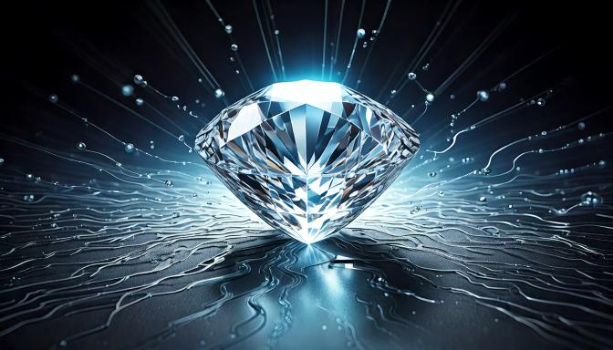

# Deep Learning applied to Spectral Imaging of Magnetic Noise

**[Website in development...]**

As a postdoc in **The City College of New York** (CCNY, USA), I combined my experimental skills in quantum sensing along with machine learning techniques. In collaboration with **University College London** (UCL, UK) and **Universidad Nacional de Córdoba** (UNC, Argentina), we published a research article titled **Toward Deep-Learning-Assisted Spectrally Resolved Imaging of Magnetic Noise**, in the journal *Physical Review Applied* in 2022.

[Link to the research article](https://journals.aps.org/prapplied/abstract/10.1103/PhysRevApplied.18.024004) 👈🏽.

The full list of authors include:
* Fernando Meneses (CCNY).
* David F. Wise (UCL).
* Daniela Pagliero (CCNY).
* Pablo R. Zangara (UNC).
* Siddharth Dhomkar (UCL).
* Carlos A. Meriles (CCNY).

The main concept of the work was to we probe the response of **quantum defects in diamond** in the presence of a **magnetic environment** and implement a **deep neural network** to extract information about the **noise spectral density**. Our method was compared to traditional approaches, excluding artificial intelligence, demonstrating a **better performance and more precise results**.

<figure>
   
  <figcaption>AI-generated image, prompt: "A small diamond on top of a flat metallic surface with unknown content underneath, with energy waves".</figcaption>
</figure>

## Introduction

Quantum sensing using diamonds (briefly)

Magnetic environments: noise as an obstacle or a signature.

Complex signals, theory and numerical methods are limited. Machine Learning approach could improve the precision in results.

## Deep Learning algorithm

Description: auto-encoder.

Some code from Siddharth.

## Results

Spectral noise recognition successful. Improved precision compared to numerical methods.

Possibility to improve with larger experiments, larger training datasets.

## Conclusions

Important milestone in deep learning approaches for magnetic noise spectroscopy. Experimental methods can be combined with theory, simulations and machine learning algorithms, benchmarking results from traditional numerical methods.

